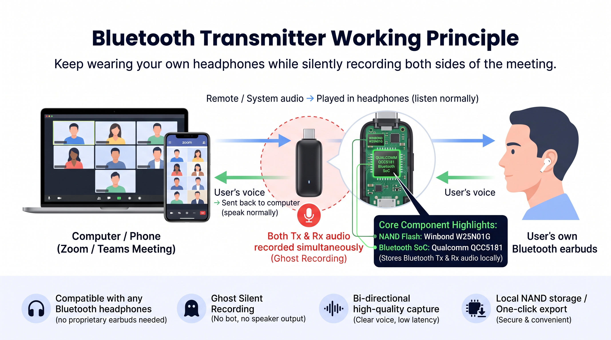

# Bluetooth-Transmitter-with-Ghost-Recording
A USB-C Bluetooth audio transmitter that lets you keep using your own headphones while silently capturing both sides of any meeting.

Plug the dongle into your computer or phone during Zoom/Teams (or any VoIP) calls. It appears as a normal Bluetooth transmitter:

- Remote / system audio is played cleanly into your personal earbuds
- Your voice is sent back to the computer so you can speak normally
- At the same time, both the transmit (your voice) and receive (remote participants) audio streams are recorded locally in high quality — completely silently, with no bot, no speaker output, and no interruption to the call

**Key features**
- Works with any standard Bluetooth headphones (no proprietary earbuds required)
- True bi-directional “Ghost Recording” of Tx + Rx audio
- Qualcomm QCC5181 Bluetooth SoC + Winbond W25N01G NAND flash for local storage
- Low-latency, clear voice capture
- One-click export of the recorded audio

Open-source hardware & firmware focused on private, local meeting recording without changing how you already work.

## PC software

The `PC software` folder contains Python tools for managing recordings stored on the device. The tools can extract recorded meetings from the device, decode the recorded Opus audio, and read live meeting audio from the device for real-time transcription, translation, and meeting summaries.

- `test_recorder.py` provides the main desktop interface for communicating with the recorder, managing stored recordings, downloading recording files, and receiving live audio streams.
- `opus_decoder.py` decodes the device's Opus recording data to WAV audio.
- `funasr_client.py` sends live audio to FunASR for real-time speech recognition and translation.
- `live_meeting_summarizer.py` processes live transcripts and generates meeting summaries.
- `dashscope_llm.py` provides the DashScope language-model integration used for meeting summaries.

## Prebuilt firmware

`flash_image.xuv` is a prebuilt firmware image that can be flashed to the device. The firmware source is not included because it depends on files from the Qualcomm ADK, which are not redistributed here to avoid potential licensing and copyright issues. To request access to the source code, email `394645065@qq.com`.

PIO configuration

#define W25N01G_PIO_SPI_CS          PIO1

#define W25N01G_PIO_SPI_MISO        PIO2

#define W25N01G_PIO_SPI_MOSI        PIO3

#define W25N01G_PIO_SPI_CLK         PIO4
